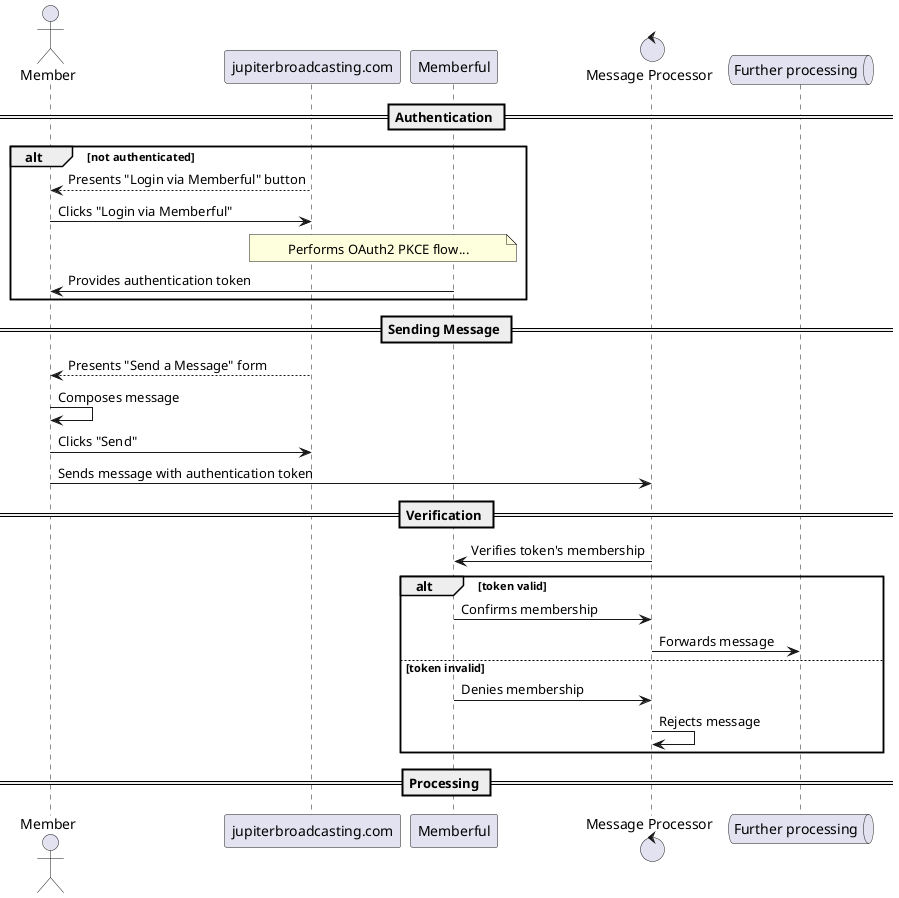

# Member's mail

## Sending message flow for members

```puml
@startuml members-mail

actor Member as M
participant "jupiterbroadcasting.com" as JBW
participant "Memberful" as MF
control "Message Processor" as MP
queue "Further processing" as FP

== Authentication ==

alt not authenticated
JBW --> M: Presents "Login via Memberful" button
M -> JBW: Clicks "Login via Memberful"
note over JBW, MF: Performs OAuth2 PKCE flow...
MF -> M: Provides authentication token
end

== Sending Message ==

JBW --> M: Presents "Send a Message" form
M -> M: Composes message
M -> JBW: Clicks "Send"
M -> MP: Sends message with authentication token

== Verification ==

MP -> MF: Verifies token's membership
alt token valid
  MF -> MP: Confirms membership
  MP -> FP: Forwards message
else token invalid
  MF -> MP: Denies membership
  MP -> MP: Rejects message
end


== Processing ==


@enduml
```